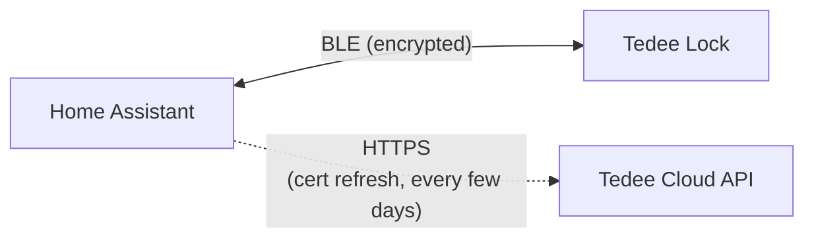
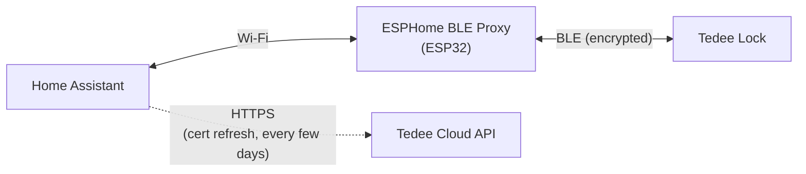

<p>
  
</p>

# Tedee BLE - Home Assistant Integration

[](https://hacs.xyz)
[](https://my.home-assistant.io/redirect/hacs_repository/?owner=meltingice1337&repository=tedee_ble&category=integration)

Control your Tedee smart lock over **Bluetooth Low Energy** directly from Home Assistant.

**What you need:**
- **Home Assistant 2024.1.0** or newer
- A **Tedee lock** — GO, GO 2, or PRO (all confirmed working)
- A **Bluetooth adapter** on your Home Assistant host (built-in or USB dongle), **or** an **[ESPHome Bluetooth Proxy](https://esphome.github.io/bluetooth-proxies/)** (ESP32) within BLE range of the lock (~10m, varies by environment)
- A free **Tedee Personal Access Key** from the [Tedee Portal](https://portal.tedee.com) (used during setup for certificate registration)

**What you don't need:**
- A **Tedee Bridge** - the integration talks directly to the lock over BLE
- A **permanent cloud connection** - the lock only accepts commands from a device holding a certificate that Tedee signed for it, and your API key is what lets the integration obtain one during setup. After that, lock commands happen locally over BLE; the cloud is only contacted every few days to renew the certificate

---

## Table of contents

- [Features](#features)
- [Installation](#installation)
- [Setup](#setup)
- [Entities](#entities)
- [Dashboard card](#dashboard-card)
- [How it works](#how-it-works)
- [Troubleshooting](#troubleshooting)
- [CLI tool](#cli-tool)

---

## Features

- **Lock, Unlock, and Open** - Full lock control including pull spring (open latch) support. The lock entity also surfaces transitional states like `locking`, `unlocking`, `partially_unlocked`, and `jammed`
- **Auto-pull on unlock** - Optional setting; when **disabled**, the integration sends `UNLOCK_NO_PULL` so the lock-side auto-pull setting (configured in the Tedee mobile app) is overridden — the Home Assistant toggle is the single source of truth for spring-pull behavior
- **Door open/closed sensor** - If your Tedee lock has the optional **door sensor** accessory installed, the integration exposes a binary sensor showing whether the door is open or closed
- **Battery monitoring** - Battery percentage as a sensor, with a `charging` attribute exposed alongside it
- **Real-time state updates** - Lock state changes are pushed instantly via BLE notifications, with a 10-minute polling safety net and a 45-second keep-alive
- **Jam detection** - The lock reports if it gets jammed during locking or unlocking
- **Activity tracking** - See who triggered the last action and how (see [details below](#activity-tracking))
- **Firmware-update awareness** - Firmware version shown on the device page; a diagnostic binary sensor turns on when an update is available (per cloud API) **or** while the lock is actively applying one. The lock entity exposes `is_updating: true` during a flash and rejects `lock` / `unlock` / `open` service calls so automations don't fire mid-update
- **Persistent connection with auto-reconnect** - The integration maintains a live BLE connection and automatically reconnects if it drops (forever, with backoff), with a grace period that hides brief reconnections from the UI
- **MAC-address auto-recovery** - If a firmware update changes the lock's BLE MAC, the integration rediscovers it by service UUID and updates the stored address — no reconfigure or HA restart needed
- **Direct BLE and ESPHome Bluetooth Proxy** - Connect directly from your Home Assistant host's Bluetooth adapter, or route through an [ESPHome Bluetooth Proxy](https://esphome.github.io/bluetooth-proxies/) for extended range
- **Custom dashboard card** - A built-in Lovelace card with animated status icons, smart action buttons, and at-a-glance info

## Installation

### HACS (recommended)

1. Open HACS in Home Assistant
2. Search for **Tedee BLE** and install
3. Restart Home Assistant

### Manual

1. Copy the `custom_components/tedee_ble` folder to your Home Assistant `config/custom_components/` directory
2. Restart Home Assistant

## Setup

1. Go to **Settings > Devices & Services > Add Integration**
2. Search for **Tedee BLE**
3. Enter your Tedee Personal Access Key ([how to get one](#getting-your-api-key))
4. Select your lock from the list
5. The integration will scan for the lock over BLE - make sure your HA host has Bluetooth (or an ESPHome proxy) and is in range
6. If the scan doesn't find it, you can enter the BLE MAC address manually

> **Tip — auto-discovery:** If your HA host (or an ESPHome proxy) is already in BLE range, the lock is usually **auto-discovered**. A *"Tedee lock found"* card appears under **Settings → Devices & Services**; click **Configure**, enter your Personal Access Key, and setup finishes without the manual lock-picker or scan step.

### Getting your API key

The integration needs a Tedee Personal Access Key to register with the lock and obtain BLE certificates. After setup, all lock commands happen locally over BLE - the cloud API is only contacted every few days to refresh certificates. Your API key never leaves your Home Assistant instance.

1. Go to [Tedee Portal](https://portal.tedee.com) and log in
2. Navigate to **Personal Access Keys**
3. Create a new key with the following scopes:
   - **Device.Read** - discover your locks
   - **DeviceCertificate.Operate** - obtain BLE certificates
   - **Mobile.ReadWrite** - register as a mobile device
   - **DeviceActivity.Read** - read activity logs for user identification
4. Copy the key - you'll paste it during integration setup

### Configuration options

After setup, click the **Configure** button on the integration to adjust:

- **Auto-pull on unlock** - When enabled, unlocking the lock will also automatically pull the spring to unlatch the door. When disabled, the integration sends `UNLOCK_NO_PULL` to the lock, which **overrides** the lock-side auto-pull setting from the Tedee mobile app — so the HA toggle alone determines whether the spring pulls. Takes effect on the next unlock; no reload required.

## Entities

The integration creates the following entities per lock, all grouped under a single device:

| Entity | Type | Description |
|--------|------|-------------|
| **Lock** | `lock` | Lock, unlock, and open (pull spring). Surfaces `locking`, `unlocking`, `partially_unlocked`, and `jammed` states. Exposes `last_action`, `last_trigger`, `last_user`, and `is_updating` as attributes. |
| **Door** | `binary_sensor` | Door open/closed state. Requires the optional **Tedee door sensor** accessory to be installed on the lock. |
| **Battery** | `sensor` | Battery percentage. Exposes a `charging` attribute (diagnostic). |
| **Door sensor battery** | `sensor` | Battery percentage of the **door sensor accessory**. Only created when a door sensor is paired. See the note below on when it populates. Diagnostic. |
| **Firmware update** | `binary_sensor` | On while a firmware update is available **or** being applied. Exposes a `status` attribute (`available` / `updating` / `idle`). Diagnostic. |

Each lock-state change also fires a `tedee_ble_lock_action` event on the bus (with `action`, `trigger`, `user`, `entity_id`, `lock_name`) — useful for automations and the logbook.

The **firmware version** is shown on the device info page (Settings > Devices > your lock), not as a separate entity.

### Door sensor battery

This one behaves differently from every other entity, so it's worth knowing what to expect.

The lock has **no command to report its accessories' battery** — the level arrives only as an unprompted notification, on the lock's own schedule. In testing that was roughly **once a day**. There is no way to make it report sooner.

What this means in practice:

- The entity is **only created if a door sensor is paired**. The integration detects this at startup, so on a lock without the accessory it never appears at all. If you pair one later, reload the integration (or restart Home Assistant) for it to show up.
- It will read **unavailable until the very first report arrives**, which can take up to a day after setup. That is expected, not a fault.
- After that, the value is **restored across restarts**, so it should never go unavailable again.
- Because reports are infrequent, the value can legitimately be hours old. Two attributes let you tell:
  - **`last_reported`** — timestamp of the reading, as reported by the lock.
  - **`restored`** — `true` when the value came from the previous Home Assistant run rather than a live report.

Use it for a low-battery alert, not as a live gauge.

### Activity tracking

The lock entity exposes three attributes describing the most recent state change:

- **`last_action`** - the resulting state, e.g. `locked`, `unlocked`, `partially_unlocked`, `pulling`. The dashboard card uses this to render fine-grained states the core `lock` domain doesn't surface.
- **`last_trigger`** tells you *how* it was triggered. The exact tokens you'll see in the attribute are:
  - `button` - physical button press on the lock
  - `remote` - BLE command from Home Assistant or phone
  - `keypad` - PIN entry on a connected Tedee Keypad
  - `auto_lock` - the lock's built-in auto-lock timer
  - `auto_unlock` / `auto` - auto-unlock feature
  - `door_sensor` - triggered by opening or closing the door
  - `manual` - turned by hand
- **`last_user`** tells you *who* triggered it, resolved from a user ID to a name. The integration builds a mapping of user IDs to names from the Tedee Cloud API activity logs (including keypad PIN aliases). This map is automatically refreshed during periodic certificate renewals and whenever an unknown user is detected, so new shares are picked up without any manual action.

## Dashboard card

The integration ships with a built-in **Tedee Lock Card** that shows everything in a single compact row:

<p>
  
</p>

The card is **auto-registered** on startup - no need to add it as a resource manually.

### Card configuration

```yaml
type: custom:tedee-lock-card
lock: lock.lock_lock
door: binary_sensor.lock_door       # optional
battery: sensor.lock_battery        # optional
event: lock.lock_lock               # optional — entity whose dialog opens when the activity row is clicked (defaults to the lock)
name: Front Door                    # optional, overrides entity name
show_activity: true                 # optional, default true — set false to hide the activity row
```

**What it shows:**
- State-colored lock icon (green = locked, amber = unlocked, blue = transitioning, red = jammed, **purple = applying firmware update**, grey = unavailable)
- Animated icon (pulse during locking/unlocking and during firmware update, shake when jammed)
- Smart buttons - only shows actions that make sense (e.g. "Open" only appears when unlocked); **all buttons are hidden while the lock is applying a firmware update**
- Door state and battery chips - click to open their respective entity dialogs
- Last user and trigger source (button press, remote command, auto-lock, door sensor)

## How it works

**Direct BLE connection** — Home Assistant talks to the lock directly over encrypted BLE; an HTTPS path to the Tedee Cloud API is used only for the periodic certificate refresh.



**Via ESPHome Bluetooth Proxy** — Home Assistant reaches an ESP32 BLE proxy over Wi-Fi, which relays encrypted BLE to the lock. The cloud path is unchanged.



1. **Device Registration** - The integration registers with Tedee's Cloud API and obtains a signed certificate for BLE authentication
2. **BLE Discovery** - The integration scans for your lock over Bluetooth (directly or through an ESPHome proxy), filtering by the lock's service UUID derived from its serial number
3. **Encrypted Session** - A secure, encrypted BLE session is established using the certificate
4. **Persistent Connection** - The integration maintains a persistent BLE connection with a 45-second keep-alive (the lock drops idle connections after ~25-45 s of inactivity), plus a 10-minute polling safety net
5. **Real-time Notifications** - Lock state changes are pushed instantly via BLE notifications
6. **Automatic Reconnection** - If the BLE connection drops, the integration reconnects automatically with escalating backoff (2 s → 5 s → 10 s → 30 s → 1 min → 2 min → 5 min → 10 min, then every 10 min, forever). A 15-second grace period prevents brief reconnections from showing entities as "unavailable". If an ESPHome proxy reports it's out of connection slots, the backoff jumps straight to 5 minutes so the proxy can recover instead of being hammered
7. **MAC-Address Recovery** - If the lock's BLE MAC changes (e.g. after a firmware update), the integration first checks Home Assistant's discovery cache by service UUID; if that misses, it falls back to a live active BLE scan and silently updates the stored address. No HA restart or reconfigure is required

## Troubleshooting

### Lock not found during BLE scan
- Make sure Bluetooth is enabled on your HA host
- Move the HA host closer to the lock
- Check that no other device (phone, bridge) is monopolizing the BLE connection
- You can enter the MAC address manually if the scan fails

### Frequent disconnections
- The Tedee lock (especially the GO model) drops idle BLE connections after ~25-45 seconds. This is normal battery-saving behavior. The integration reconnects automatically in ~2-5 seconds, and a grace period prevents entities from briefly showing as "unavailable"
- If entities stay unavailable for longer periods, check BLE range - move the HA host closer, or use an [ESPHome Bluetooth Proxy](https://esphome.github.io/bluetooth-proxies/) placed near the lock
- Interference from other 2.4GHz devices (Wi-Fi, Zigbee) can cause disconnections

### Stuck unavailable after a firmware update
- Firmware updates put the lock offline for a few minutes and can change its BLE MAC. The integration's reconnect loop will pick it up automatically once the lock starts advertising again
- If you don't want to wait, click **Reload** on the Tedee BLE integration (Settings → Devices & Services → Tedee BLE → ⋯ → Reload). This re-runs setup, which rediscovers the lock by service UUID and updates the stored MAC

### Certificate errors
- The integration auto-refreshes certificates in the background. If you see persistent errors, remove and re-add the integration

### API key revoked or missing permissions
- If your Personal Access Key is later revoked or loses a required scope, Home Assistant raises a **re-authentication** prompt (a *"Reconfigure"* / repair notification on the Tedee BLE integration). Paste a fresh key from the [Tedee Portal](https://portal.tedee.com) — no need to remove and re-add the integration. The key must belong to the same account that owns the lock

### Reporting an issue

If you run into a problem, please [open an issue](https://github.com/meltingice1337/tedee_ble/issues) and include the following:

1. **Lock model and firmware version** (e.g. Tedee GO 2, firmware 2.4.18050)
2. **Connection type** - direct Bluetooth or ESPHome Bluetooth Proxy (and if proxy, the ESP32 board model)
3. **Debug logs** - enable debug logging by adding this to your `configuration.yaml` and restarting:
   ```yaml
   logger:
     default: info
     logs:
       custom_components.tedee_ble: debug
   ```
   Then reproduce the issue and include the relevant log output from **Settings > System > Logs**.
4. **Steps to reproduce** - what you did before the issue occurred

## CLI tool

The repo includes a standalone `cli.py` for testing and debugging the BLE connection outside of Home Assistant. It uses the same underlying library as the integration and supports both direct Bluetooth and ESPHome proxy.

```bash
python cli.py scan                           # Find Tedee locks nearby
python cli.py register                       # One-time: generate keys and register with Tedee cloud
python cli.py connect                        # Test the connection and PTLS handshake
python cli.py status                         # Get lock state and battery
python cli.py lock [--force]                 # Lock the door
python cli.py unlock [--force] [--pull]      # Unlock (--pull to also pull spring)
python cli.py pull                           # Pull spring only
python cli.py info [--raw]                   # Show lock model, serial, firmware from cloud
python cli.py access                         # Show who has access and recent activity (debug)
python cli.py shell                          # Interactive session with persistent connection

# Via ESPHome Bluetooth Proxy
python cli.py --proxy 192.168.1.50 scan
python cli.py --proxy 192.168.1.50 shell
```

## License

MIT License - see [LICENSE](https://github.com/meltingice1337/tedee_ble/blob/master/LICENSE)
